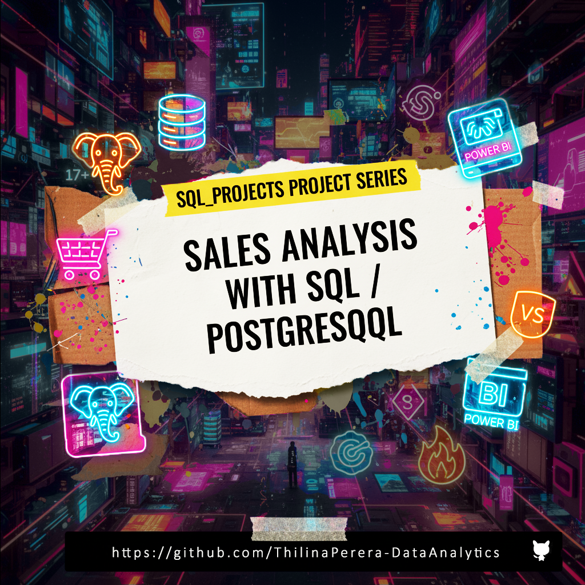

# Sales Analysis with SQL (PostgreSQL)
```
Capstone Project
Intermediate SQL for Data Analytics
by Luke Barousse & Kelly Adams
```
---
<p align="center">
  
</p>

[📊 Interact with my Power BI Dashboard](https://app.powerbi.com/view?r=eyJrIjoiY2NlYzNjN2MtZGQ2YS00NDE2LWFhNGYtODEzYmQzY2Y5ZDBkIiwidCI6ImM0ZGRhYWFjLTQ4OWItNGQ1Zi1hMzVjLWFhODVlNmVkZjhkOCJ9&pageName=fa9447fa4c012e457c1d)
---
## Overview
Analysis of customer behavior, retention, and lifetime value for an e-commerce company to improve customer retention and maximize revenue.

[](https://linkedin.com/in/thilina-perera-148aa934/)
---

## 🗂️ Project Folder Structure
```yml
SQL_Projects_Sales_Analysis_of_e-Commerce_Company 
│
├── data/
│   └── contoso_100k.sql        # Schema + table creation
│
├── visuals/
│   ├── Cohort_Analysis.pbix    # Final Power BI report
│   └── visuals_screenshots     # PNG exports of dashboards
│
├── cover_image.png
├── LICENSE.md
├── README.md                   # Project documentation
└── .gitignore
```
---
## Business Questions
1. **Customer Segmentation:** <br> Who are our most valuable customers?
2. **Cohort Analysis:** <br> How do different customer groups generate revenue?
3. **Retention Analysis:** <br> Which customers haven't purchased recently?
---
## 🛠️ Tech Stack
- *Database* - **PostgreSQL 17+** 
- *Analysis Tools/ IDE* - **DBeaver + VSCode**
- *Visualization & Publish to web* - **Power BI Desktop & Power BI Services** 
- *Version control & portfolio showcase* - **Git + GitHub + LinkedIn** 
---
## Clean Up Data and Create a View

[**🖥️ Query**](view_ca.sql)
```sql
CREATE OR REPLACE VIEW cohort_analysis AS

WITH customer_revenue AS (
	SELECT
		s.customerkey,
		s.orderdate,
		sum(s.quantity * s.netprice * s.exchangerate) AS total_net_revenue,
		count(s.orderkey) AS num_orders,
		max(c.countryfull::text) AS countryfull,
		max(c.age) AS age,
		max(c.givenname::text) AS givenname,
		max(c.surname::text) AS surname
	FROM
		sales s
	LEFT JOIN customer c ON
		s.customerkey = c.customerkey
	GROUP BY
		s.customerkey,
		s.orderdate
	ORDER BY
		s.customerkey,
		s.orderdate
)
 SELECT
	customerkey,
	orderdate,
	total_net_revenue,
	num_orders,
	countryfull,
	age,
	concat(TRIM(BOTH FROM givenname), ' ', TRIM(BOTH FROM surname)) AS cleaned_name,
	min(orderdate) OVER (
		PARTITION BY customerkey
	) AS first_purchase_date,
	EXTRACT(YEAR FROM min(orderdate) OVER (PARTITION BY customerkey)) AS cohort_year
FROM
	customer_revenue cr;
```

- Aggregated sales and customer data into revenue metrics
- Calculated first purchase dates for cohort analysis
- Created view combining transactions and customer details
---
## 🕵️ Analysis

### 1. Customer Segmentation
[**🖥️ Query**](/Q1_Customer_Segmentation.sql)
```sql
WITH customer_ltv AS (
	SELECT ca.customerkey, ca.cleaned_name,
		sum(ca.total_net_revenue ) AS total_ltv
	FROM cohort_analysis ca
	GROUP BY ca.customerkey, ca.cleaned_name
	ORDER BY ca.customerkey
),
customer_segment AS (
	SELECT
		PERCENTILE_CONT(0.25) WITHIN GROUP (ORDER BY total_ltv) AS ltv_25th_prcntile,
		PERCENTILE_CONT(0.75) WITHIN GROUP (ORDER BY total_ltv) AS ltv_75th_prcntile
	FROM customer_ltv
),
segment_values AS (
	SELECT
      cl.*,
		CASE 
			WHEN cl.total_ltv < cs.ltv_25th_prcntile THEN '1 - Low Value'
			WHEN cl.total_ltv > cs.ltv_75th_prcntile THEN '3 - High Value'
			ELSE '2 - Mid Value'
		END AS customer_segment
	FROM customer_ltv cl, customer_segment cs
)
SELECT
   customer_segment,
	sum(total_ltv) AS total_ltv,
	count(customerkey) AS customer_count,
	sum(total_ltv) / count(customerkey) AS avg_ltv
FROM segment_values
GROUP BY customer_segment
ORDER BY customer_segment DESC
```


---
### 2. Customer Revenue by Cohort Year
[**🖥️ Query**](/Q2_Cohort_Analysis.sql)
```sql
SELECT 
	cohort_year,
	sum(total_net_revenue) AS total_revenue,
	count(DISTINCT customerkey) AS total_customers,
	sum(total_net_revenue) / count(DISTINCT customerkey) AS customer_revenue
FROM cohort_analysis
WHERE orderdate = first_purchase_date 
GROUP BY cohort_year
```


---
### 3. Customer Retention & Churn
[**🖥️ Query**](/Q3_Retention_Analysis.sql)
```sql
WITH last_purchase AS (
	SELECT
		ca.customerkey, ca.cleaned_name, ca.orderdate AS last_purchase_date,
		ROW_NUMBER() OVER(PARTITION BY customerkey ORDER BY orderdate DESC) AS rn,
		ca.cohort_year, ca.first_purchase_date
	FROM cohort_analysis ca
),
churned_customers AS (
	SELECT
      customerkey, cleaned_name, cohort_year, last_purchase_date,
		CASE 
			WHEN last_purchase_date  < (SELECT max(orderdate) FROM sales) - INTERVAL '6 months' THEN 'Churned'
			ELSE 'Active'
		END AS customer_status
	FROM last_purchase 
	WHERE rn = 1 AND first_purchase_date < (SELECT max(orderdate) FROM sales) - INTERVAL '6 months'
)
SELECT
	cohort_year, customer_status,
	count(customerkey) AS num_customers,
	sum(count(customerkey)) OVER(PARTITION BY cohort_year) AS total_customers,
	round(count(customerkey) * 100 / sum(count(customerkey)) OVER(PARTITION BY cohort_year), 2) AS status_prctage
FROM churned_customers
GROUP BY cohort_year, customer_status
```


---
### 📈 Dashboard

---
## 🤺  Strategic Recommendations

1. **Customer Value Optimization** (Customer Segmentation)
   - Launch VIP program for 12,372 high-value customers (66% revenue)
   - Create personalized upgrade paths for mid-value segment ($66.6M → $135.4M opportunity)
   - Design price-sensitive promotions for low-value segment to increase purchase frequency

2. **Cohort Performance Strategy** (Customer Revenue by Cohort)
   - Target 2022-2024 cohorts with personalized re-engagement offers
   - Implement loyalty/subscription programs to stabilize revenue fluctuations
   - Apply successful strategies from high-spending 2016-2018 cohorts to newer customers

3. **Retention & Churn Prevention** (Customer Retention)
   - Strengthen first 1-2 year engagement with onboarding incentives and loyalty rewards
   - Focus on targeted win-back campaigns for high-value churned customers
   - Implement proactive intervention system for at-risk customers before they lapse

## 🙏 Acknowledgement

* Huge thanks to `Luke Barousse` & `Kelly Adams` for the dataset and guidance.! 🤗
* [SQL+ for Data Analytics](https://www.lukebarousse.com/int-sql) by `Luke Barousse`
---

## 👨‍💻 Author
**Thilina Perera | Data with TP**
```
📌 Data Science/ Data Analytics D-Technosavant
📌 Machine Learning, Deep Learning, LLM/LMM, NLP, and Automated Data Pipelines Inquisitive
``` 
[](https://linkedin.com/in/thilina-perera-148aa934/)  [](https://tiktok.com/@data_with_tp) [](https://youtube.com/@Data_with_TP) [](mailto:kgttpereraqatar2022@gmail.com) 

## 🏆 License
    This project is licensed under the MIT License.
    Free to use and extend.


